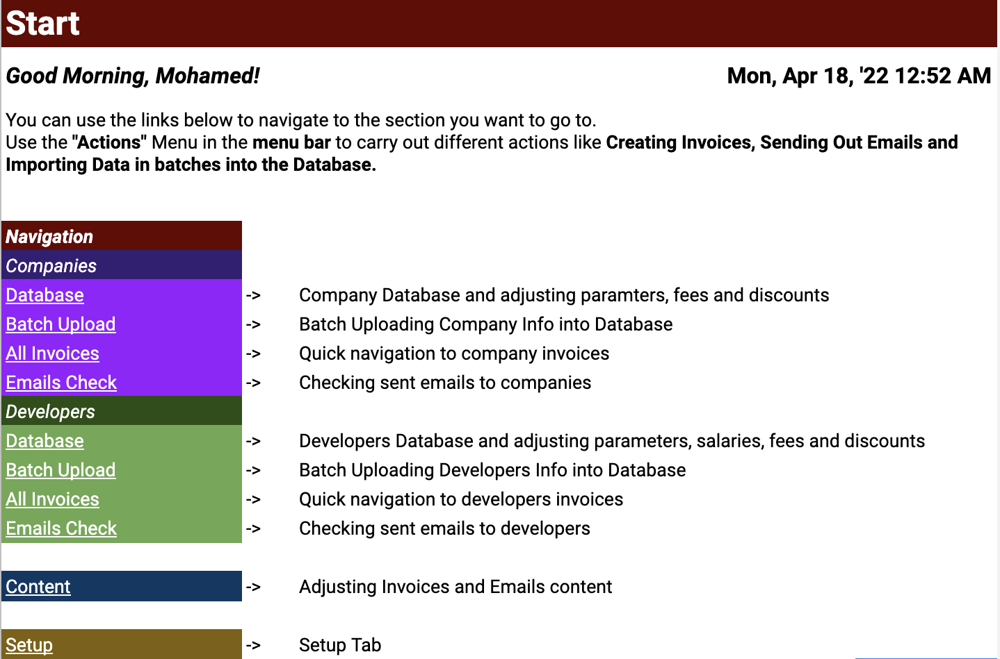

# gas-auto-invoicing-script
Auto Invoicing Script that generates HTML based Invoices sourcing from entries in a google sheet and certain business logic




## Table of Contents

* [Technologies](#technologies)
* [Installation](#installation)
* [Features](#features)
* [Questions](#questions)


## Technologies 

* Google Apps Script
* JavaScript ES6
* HTML5
* CSS3
* Lodash
* clasp

## Installation

To install this application, in VS code after cloning the repo, use [clasp CLI](https://developers.google.com/apps-script/guides/clasp) to create the .clasp.json file

```
clasp create [scriptTitle]
```

Then add the destination script id to the .clasp.json file and then push the code using the following command

```
clasp push
```


## Features

* Fetches data from Google sheets to create periodic Invoices automatically every month
* Builds invoices based on HTML Templates using Lodash Template Engine
* Uses custom logic to add and remove lines from the invoices
* Sends out emails with invoices to clients and freelanceers
* writes back confirmations and invoices PDFs to sheet


## Questions 

If you have any more questions, please contact me here:

Github Username: [mohamedallam13](https://mohamedallam13.github.io/react-professional-portfolio/)

Email: [mohamedallam.tu@gmail.com](mailto:mohamedallam.tu@gmail.com)

